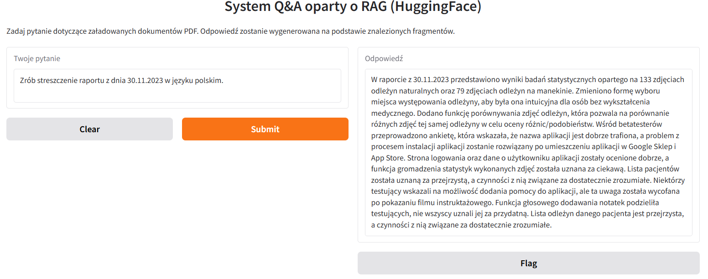
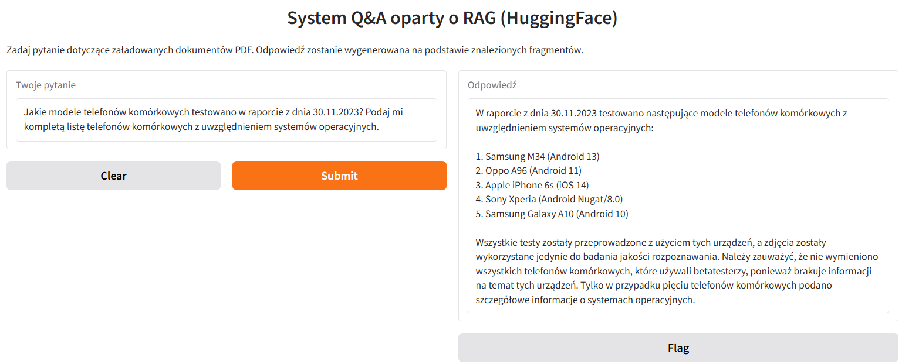

# RAG + HuggingFace Q&A z interface Gradio

System Q&A oparty o RAG (Retrieval-Augmented Generation) z użyciem HuggingFace, LangChain i Gradio
pozwala zadawać pytania do własnych dokumentów PDF (np. raportów, earnings calls) i otrzymywać odpowiedzi generowane przez nowoczesny model językowy.

Chcesz zbudować własny, gotowy do użycia system Q&A na bazie Debiana?

Połącz ten tutorial z moim projektem tworzenia własnej dystrybucji Debiana z WebUI!
Dzięki temu możesz przygotować własny obraz Live ISO Debiana z preinstalowanym środowiskiem Q&A oraz graficznym interfejsem WebUI (Gradio lub Flask).

Repozytorium: [my-debian-live-webui](https://github.com/SebastianSebastianB/my-debian-live-webui)  
Opis projektu:
Własny obraz Live Debian + instalacja z WebUI - Cz.1
Ten projekt pokazuje, jak krok po kroku zbudować własny obraz ISO Debiana z lekkim środowiskiem graficznym XFCE oraz własnym WebUI napisanym w Pythonie (Flask).
Dzięki temu możesz stworzyć własną, spersonalizowaną dystrybucję Debiana!

Połącz oba tutoriale i stwórz własny system Q&A działający od razu po uruchomieniu z pendrive’a na PC lub na wirtualnej maszynie!

Ten projekt łączy w sobie: **RAG + HuggingFace + ChromaDB + Gradio**. Takie połączenie ma potencjał stworzenia systemu działającego całkowicie offline, bez konieczności łączenia się z usługami firm trzecich. Zapewnia to pełną kontrolę i bezpieczeństwo przetwarzanych danych, jednak wymaga posiadania oraz utrzymania odpowiednio wydajnego sprzętu obliczeniowego.

Potencjalne zastosowanie to nie tylko Q&A na podstawie dokumentów, raportów oraz danych firmowych, ale też w:
- istytucjach użyteczności publicznej (Urzędy, Muzea itp.),
- konferencje naukowe.

---

## 📋 Spis treści

1. [Opis projektu](#opis-projektu)
2. [Demo](#demo)
3. [Wymagania](#wymagania)
4. [Instalacja](#instalacja)
5. [Szybki start](#szybki-start)
6. [Jak to działa?](#jak-to-działa)
7. [Plan dalczych prac](#plan-dalczych-prac)
8. [Autor i licencja](#autor-i-licencja)

---

## Opis projektu

Ten tutorial pokazuje, jak zbudować własny system Q&A do dokumentów PDF w oparciu o architekturę RAG.  
Repozytorium zawiera polskojęzyczną wersję **materiałów dydaktycznych** przygotowanych na potrzeby laboratorium komputerowego dla studentów. 
Poziom zaawansowania: **średniozaawansowany** (wymagana podstawowa znajomość Pythona i zagadnień NLP - Natural Language Processing).  

**Główne technologie:**
- HuggingFace (Sentence Transformers, LLM)
- LangChain
- ChromaDB (baza wektorowa)
- Gradio (interfejs webowy)

---

## Demo

Po uruchomieniu aplikacji Gradio możesz zadawać pytania dotyczące załadowanych dokumentów PDF i otrzymywać odpowiedzi generowane przez model językowy.





---

## Wymagania

- Python 3.9+
- Konto (bezpłatne) na HuggingFace (do pobrania modelu LLM i API tokenu)
- Pliki PDF do przetworzenia (umieść w katalogu `data/`)

---

## Instalacja

Zalecane jest użycie środowiska wirtualnego:

```bash
python -m venv venv
venv\Scripts\activate  # Windows
# source venv/bin/activate  # Linux/Mac

pip install --upgrade pip
pip install sentence-transformers langchain chromadb pypdf gradio
```

---

## Szybki start

1. Umieść swoje pliki PDF w katalogu `data/`.
2. Skonfiguruj swój token HuggingFace (`HUGGINGFACEHUB_API_TOKEN`).
3. Uruchom notatnik [`RAG_HF_PL.ipynb`](RAG/notebooks/RAG_HF_PL.ipynb).
4. Postępuj zgodnie z instrukcjami w notebooku – kolejne komórki przeprowadzą Cię przez:
    - Wczytanie i podział dokumentów PDF na fragmenty
    - Generowanie embeddings i budowę bazy wektorowej
    - Wyszukiwanie podobnych fragmentów na podstawie pytania
    - Generowanie odpowiedzi przez LLM
    - Uruchomienie interfejsu Gradio

---

## Jak to działa?

1. **Indeksowanie dokumentów**  
   Pliki PDF są dzielone na fragmenty i zamieniane na wektory (embeddings) przy użyciu Sentence Transformers.

2. **Budowa bazy wektorowej**  
   Embeddings są zapisywane w lokalnej bazie ChromaDB.

3. **Wyszukiwanie**  
   Dla zadanego pytania generowany jest embedding, a następnie wyszukiwane są najbardziej podobne fragmenty dokumentów.

4. **Generowanie odpowiedzi**  
   Najbardziej istotne fragmenty oraz pytanie są przekazywane do dużego modelu językowego (LLM z HuggingFace), który generuje odpowiedź.

5. **Interfejs użytkownika**  
   Gradio umożliwia zadawanie pytań przez prosty webowy formularz.

---

## 📁 Struktura katalogów i plików projektu

```
RAG/
├── data/                   # Twoje pliki PDF
├── db_chroma/              # Baza wektorowa (generowana automatycznie)
├── notebooks/
│   └── RAG_HF_PL.ipynb     # Główny notatnik z tutorialem
```

---

## 🔗 Przydatne linki

- [LangChain Documentation](https://python.langchain.com/)
- [Sentence Transformers](https://www.sbert.net/)
- [ChromaDB](https://docs.trychroma.com/)
- [Gradio](https://www.gradio.app/)
- [HuggingFace Hub](https://huggingface.co/)

---
## Plan dalczych prac

W kolejnych etapach rozwoju projektu planuje się:

- **Integracja z OpenAI (płatny plan)**  
  Dodanie możliwości korzystania z modeli językowych OpenAI (np. GPT-4) dla jeszcze wyższej jakości generowanych odpowiedzi, z opcją wyboru modelu przez użytkownika.

- **Obsługa bazy wektorowej Pinecone**  
  Wprowadzenie wsparcia dla zewnętrznej, skalowalnej bazy wektorowej Pinecone, co umożliwi obsługę większych zbiorów dokumentów oraz łatwiejsze wdrożenia produkcyjne.

- **Rozbudowa interfejsu Gradio**  
  - Możliwość wprowadzania dodatkowych parametrów (np. liczba zwracanych fragmentów, wybór modelu embeddingów/LLM).
  - Opcja wyboru i przełączania pomiędzy różnymi modelami językowymi (HuggingFace, OpenAI lub modele lokalne).
  - Dodawanie kolejnych plików PDF bezpośrednio z poziomu interfejsu.
  - Generowanie i prezentacja prostych statystyk dotyczących bazy wektorowej oraz załadowanych plików PDF (np. liczba dokumentów, liczba fragmentów, rozmiar bazy).

- **Dalsze usprawnienia**  
  - Optymalizacja wydajności i obsługa większych zbiorów danych.
  - Możliwość eksportu wyników i historii zapytań.
  - Integracja z innymi źródłami danych (np. pliki tekstowe, Word, Excel).

---

## Autor i licencja

Autor: [Sebastian Bartel](https://github.com/SebastianSebastianB)
E-mail: umbraos@icloud.com
Licencja: MIT

---
